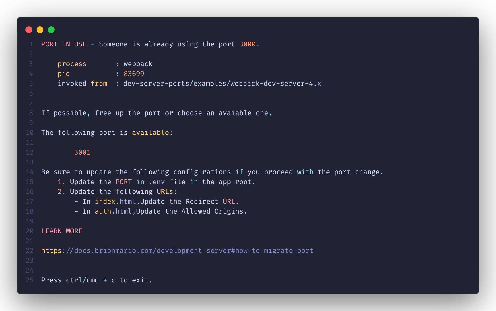
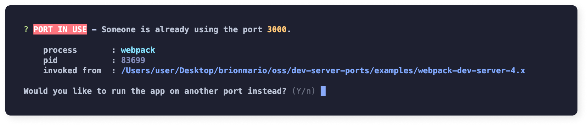
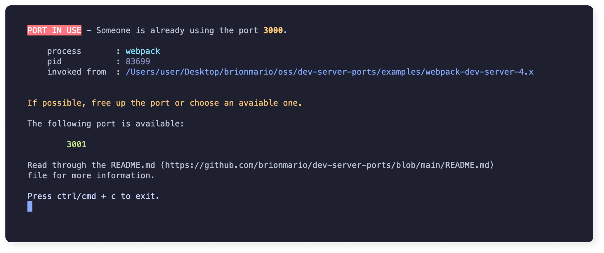

<p align="center" style="padding-top: 20px">
  
  <p align="center">Handle dev server ports like a boss 😎</p>
</p>

<div align="center">

  <a href="">[](https://badge.fury.io/js/dev-server-ports)</a>
  <a href="">[](https://github.com/brionmario/dev-server-ports/actions/workflows/build.yml)</a>
  <a href="">[](https://github.com/brionmario/dev-server-ports/actions/workflows/release.yml)</a>
  <a href=""><!-- ALL-CONTRIBUTORS-BADGE:START - Do not remove or modify this section -->[](#contributors-)<!-- ALL-CONTRIBUTORS-BADGE:END --></a>
  <a href="">[](http://commitizen.github.io/cz-cli/)</a>
  <a href="">[](https://github.com/semantic-release/semantic-release)</a>
</div>

<p align="center">
  
</p>

# Table of Contents

- 💡 [Inspiration](#inspiration)
- [Prerequisites](#prerequisites)
- [API Reference](#api-reference)
    - [findPort](#findPort)
- [Examples](#examples)
- [Contributors](#contributors)
- [License](#license)

# Inspiration

Sometimes we need to show our users a bit more context when the development ports conflict. Most of the already available packages lacks the support to customize the prompts. This package tries to solve this issue along with a lot more helpers that would supplement development pipelines when working with dev ports.

# Prerequisites

- [Node.js](https://nodejs.org/en/download/) version `>=12.0.0` is required. ([Inquirer.js](https://github.com/SBoudrias/Inquirer.js) version used in the isn't compatible with lower node versions.)

# API Reference

## `findPort`

```js
findPort(
  port: number,
  hostname?: string,
  shouldFallback?: boolean | undefined,
  reporter?: {
    extensions: Partial<IReporterExtensions>;
    overrides: Partial<IReporter>;
  }
)
```

### Returns

A `Promise` of type `number`.

### Description

|Argument|Type|Default Value|Required|Description|
|--------|----|-------------|--------|-----------|
|port|number| - |Yes|Prefered port to fire up the app in.|
|hostname|string| - |No|Host name of the application. `Ex: localhost or 127.0.0`|
|shouldFallback|boolean| true |No|Should the function return a an available port. You can set this to false if you wish to show just a message to the user in case of a port conflict.|
|reporter|`{ extensions: Partial<IReporterExtensions>; overrides: Partial<IReporter>;}`| - |No|Customize the messages shown to the user incase of a port conflict.|

### Usage

#### Basic Usage

`PORT` resolves to 3000 if the port is available. If the port is unavailable, users will get the chance to fallback to the nearest available port.

```js
const { findPort } = require("dev-server-ports");

const PORT = await findPort(3000);
```

##### Output



#### Resolve port with no fallback

If the port is not available, only a prompt will be shown to the user. You can customize this prompt to match the requirements.

```js
const { findPort } = require("dev-server-ports");

const PORT = await findPort(3000, "localhost", false, {
  extensions: {
    BEFORE_getProcessTerminationMessage: () => {
      return `Read through the README.md (https://github.com/brionmario/dev-server-ports/blob/main/README.md)
file for more information.`;
    }
  }
});
```

##### Output



# Examples

## Webpack Dev Server v4 example

Usage of the library with [Webpack Dev Server v4](https://github.com/webpack/webpack-dev-server/releases/tag/v4.8.1) which is the latest version at the time of writting, can be found below.

> 💡 Version 4.x doesn't allow to pass a function that returns a promise straight in to the `port` field of the `devServer` configuration.

- [Source Code](./examples/webpack-dev-server-4.x/).
# Contributors ✨

Thanks goes to these wonderful people ([emoji key](https://allcontributors.org/docs/en/emoji-key)):

<!-- ALL-CONTRIBUTORS-LIST:START - Do not remove or modify this section -->
<!-- prettier-ignore-start -->
<!-- markdownlint-disable -->
<table>
  <tr>
    <td align="center"><a href="http://www.brionmario.com/"><br /><sub><b>Brion Mario</b></sub></a><br /><a href="https://github.com/Brion Mario/dev-server-ports/commits?author=brionmario" title="Code">💻</a></td>
  </tr>
</table>

<!-- markdownlint-restore -->
<!-- prettier-ignore-end -->

<!-- ALL-CONTRIBUTORS-LIST:END -->

This project follows the [all-contributors](https://github.com/all-contributors/all-contributors) specification. Contributions of any kind welcome!

# License

This project is licensed under the MIT License. See the [LICENSE](./LICENSE) file for details.
